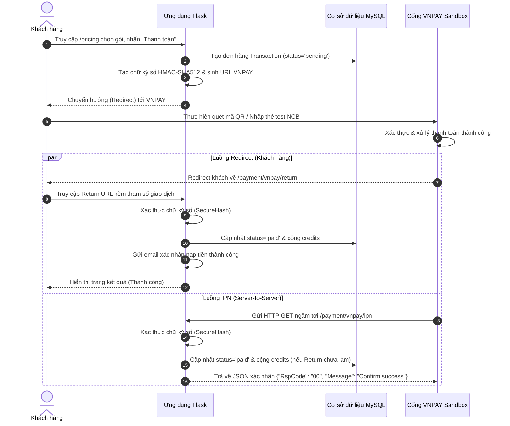

# Hướng dẫn Tích hợp Cổng thanh toán VNPAY vào Hệ thống TEXTQAI

Tài liệu này hướng dẫn chi tiết cách thức hoạt động, cấu trúc mã nguồn, quy trình luồng dữ liệu (workflow) và các bước cấu hình để tích hợp cổng thanh toán **VNPAY** vào hệ thống nạp credits tự động.

---

## 1. Tổng quan Luồng Giao Dịch (Sequence Flow)

Quy trình thanh toán qua VNPAY diễn ra theo sơ đồ các bước dưới đây:



---

## 2. Cài đặt các Tham số Môi trường (`.env`)

Cổng VNPAY yêu cầu các cấu hình cơ bản dưới đây được khai báo trong tệp [.env](file:///c:/Luanvan_Bloom/.env) để mã nguồn hoạt động:

```bash
# VNPAY - Đăng ký tại sandbox.vnpayment.vn/devreg
VNPAY_TMN_CODE=<TMN_CODE>                                        # Mã Website của bạn tại VNPAY (TmnCode)
VNPAY_HASH_SECRET=<HASH_SECRET>              # Chuỗi bí mật tạo chữ ký số (HashSecret)
VNPAY_URL=<VNPAY_URL>    # URL Cổng thanh toán (Sandbox)
VNPAY_RETURN_URL=<VNPAY_RETURN_URL> # URL nhận kết quả trả về
```

---

## 3. Cấu trúc Mã Nguồn Tích Hợp

Mã nguồn tích hợp VNPAY được tổ chức thành 3 phần chính:

### 3.1. Thư viện xử lý chữ ký & Tạo URL ([services/payment.py](file:///c:/Luanvan_Bloom/services/payment.py))

* **`vnpay_create_payment_url`**: Tạo đường dẫn thanh toán mã hóa, bao gồm đầy đủ thông số đơn hàng, địa chỉ IP của khách và thời gian hết hạn đơn (15 phút).
* **`vnpay_verify_return`**: Kiểm tra chữ ký số `vnp_SecureHash` gửi về từ VNPAY để tránh việc giả mạo kết quả thanh toán.

```python
def vnpay_create_payment_url(order_code: str, amount_vnd: int, order_info: str, ip_addr: str, return_url: str) -> str:
    now = datetime.now()
    expire = now + timedelta(minutes=15)
    params = {
        'vnp_Version':    '2.1.0',
        'vnp_Command':    'pay',
        'vnp_TmnCode':    VNPAY_TMN_CODE,
        'vnp_Amount':     str(amount_vnd * 100),  # VNPAY yêu cầu số tiền nhân 100
        'vnp_CurrCode':   'VND',
        'vnp_TxnRef':     order_code,
        'vnp_OrderInfo':  order_info,
        'vnp_OrderType':  'other',
        'vnp_Locale':     'vn',
        'vnp_ReturnUrl':  return_url,
        'vnp_IpAddr':     ip_addr,
        'vnp_CreateDate': now.strftime('%Y%m%d%H%M%S'),
        'vnp_ExpireDate': expire.strftime('%Y%m%d%H%M%S'),
    }
    secure_hash = _vnpay_sign(params)  # Tạo chữ ký HMAC-SHA512
    params['vnp_SecureHash'] = secure_hash
    return VNPAY_URL + '?' + urllib.parse.urlencode(params, quote_via=urllib.parse.quote_plus)
```

### 3.2. Endpoint Khởi tạo thanh toán ([app.py](file:///c:/Luanvan_Bloom/app.py))

Tạo giao dịch ở trạng thái `pending` trong cơ sở dữ liệu và chuyển hướng khách hàng sang VNPAY:

```python
@app.route('/payment/vnpay/create', methods=['POST'])
@login_required
def payment_vnpay_create():
    # 1. Trích xuất gói cước được lựa chọn
    package_id = request.form.get('package_id', type=int)
    pkg = get_package_by_id(package_id)
    
    # 2. Tạo mã giao dịch duy nhất
    order_code = str(int(time.time() * 1000) % 9_000_000_000 + current_user.id)
    
    # 3. Tạo Transaction và lưu vào Database ở trạng thái pending
    txn = Transaction(user_id=current_user.id, order_code=order_code, amount_vnd=pkg['price_vnd'], status='pending')
    db.session.add(txn)
    db.session.commit()
    
    # 4. Tạo đường dẫn VNPAY và Redirect khách hàng
    ip_addr = request.remote_addr
    pay_url = vnpay_create_payment_url(order_code, pkg['price_vnd'], f"Nap {pkg['credits']} credits - DH{order_code}", ip_addr, VNPAY_RETURN_URL)
    return redirect(pay_url)
```

### 3.3. Endpoint Nhận phản hồi thanh toán ([app.py](file:///c:/Luanvan_Bloom/app.py))

Xác thực chữ ký số an toàn và cập nhật điểm cho người dùng:

```python
@app.route('/payment/vnpay/return')
def payment_vnpay_return():
    params = dict(request.args)
    order_code = params.get('vnp_TxnRef', '')
    vnp_response = params.get('vnp_ResponseCode', '')
    
    # Xác minh chữ ký số của VNPAY (Bắt buộc)
    if not vnpay_verify_return(params):
        return render_template('payment_vnpay_result.html', success=False, message='Chữ ký không hợp lệ.')

    txn = Transaction.query.filter_by(order_code=order_code).first()
    if vnp_response == '00':  # Giao dịch thành công
        if txn.status != 'paid':
            txn.status = 'paid'
            user = User.query.get(txn.user_id)
            user.credits += txn.credits_added
            db.session.commit()
            
            # Gửi Email thông báo nạp tiền thành công
            send_email_smtp(user.email, "Nạp tiền thành công", f"Đã cộng +{txn.credits_added} credits...")
            
        return render_template('payment_vnpay_result.html', success=True, txn=txn)
```

---

## 4. Kiểm thử trên Môi Trường Sandbox

Để kiểm tra quy trình thanh toán trên môi trường thử nghiệm (Sandbox), bạn thực hiện như sau:

1. **Truy cập trang Bảng giá**: Vào địa chỉ `/pricing`, đăng nhập tài khoản và click **Thanh toán (VNPAY)**.
2. **Trang VNPAY Sandbox**:
   * Chọn phương thức **Thẻ nội địa và tài khoản ngân hàng**.
   * Chọn Ngân hàng: **NCB** (Ngân hàng Quốc Dân - đây là ngân hàng hỗ trợ thử nghiệm).
3. **Nhập thông tin thẻ Test**:
   * **Số thẻ**: `9704198526191432198`
   * **Tên chủ thẻ**: `NGUYEN VAN A`
   * **Ngày phát hành**: `07/15`
   * **Mã xác thực OTP**: Nhập mã bất kỳ (Ví dụ: `123456`) và nhấn xác nhận thanh toán.
4. **Kết quả**: VNPAY xử lý thành công và tự động chuyển hướng khách về website của bạn, hiển thị kết quả cộng điểm tức thì và gửi email xác nhận.
